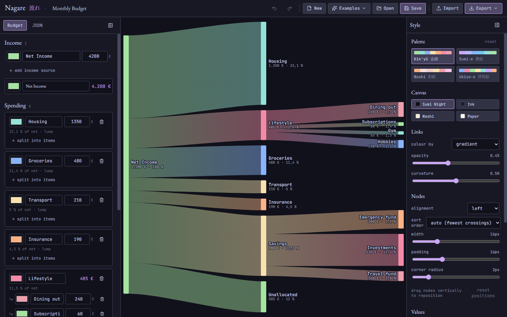

<div align="center">


# Nagare &nbsp;流れ

**_See where your money actually goes._**

[](https://react.dev)
[](https://www.typescriptlang.org)
[](https://vite.dev)
[](https://github.com/d3/d3-sankey)




</div>

## What is Nagare?

Nagare (流れ, *"flow"*) is a small web app for seeing where your money goes. You tell it what you earn and what you spend it on, and it draws the whole thing as a Sankey diagram — every euro amount and percentage worked out for you.

A category is either a single number (rent) or a handful of items that add up (*Leisure → dining + subscriptions*). Anything you haven't assigned lands in an automatic **Unallocated** flow, so the picture always balances — and if you overspend, it tells you in red.

It's all client-side. No account, no server, nothing leaves your browser — your budget lives in `localStorage`. Self-host it and it's yours.

## Features

- **Budget-first.** You fill in a budget; the diagram draws itself. No wiring up nodes by hand.
- **Lump or split.** A category is one number, or a list of items that sum up.
- **Always balances.** Leftovers become an "Unallocated" flow; overspend and it goes red.
- **Trace a flow.** Hover any node or ribbon to light up what it touches; click to inspect.
- **Drag things around.** Nudge nodes vertically to lay it out how you like — it remembers, and survives resizes.
- **Looks good.** Four ink-on-washi palettes (Kin'yū / Sumi-e / Washi / Ukiyo-e), on light or dark paper.
- **Percentages that mean something.** Share of income, of the parent flow, or of the column.
- **Export.** PNG (@2× / @4×), vector SVG, or JSON — budget only, or budget + style.
- **Import.** Drop a budget JSON back in; a full project export restores your styling too.
- **Undo / redo.** The whole history, `Ctrl+Z` / `Ctrl+Shift+Z`.
- **Local by design.** Nothing phones home.

## How it works

The budget is the single source of truth — everything on screen is *derived* from it. Income merges into a **Net Income** node, that fans out to your categories, categories with items fan out again, and whatever's left becomes **Unallocated**. Drag positions and colour tweaks ride along with the budget, and older saved diagrams get migrated on load.

```
Budget  ──deriveModel()──▶  nodes + links  ──d3-sankey──▶  layout  ──▶  hand-drawn SVG
```

[d3-sankey](https://github.com/d3/d3-sankey) does the layout maths; the SVG is drawn by hand, so hover, drag, labels and curvature all behave the way I wanted them to.

## Quick start

Uses Yarn via [Corepack](https://github.com/nodejs/corepack) — the version is pinned in `package.json`.

```bash
corepack enable
corepack yarn install
corepack yarn dev        # http://localhost:5174
```

Build the static bundle:

```bash
corepack yarn build      # tsc --noEmit && vite build → dist/
corepack yarn preview    # serve the build locally
```

## Deploy with Docker

The image is just nginx serving static files on port 80 — it doesn't care what's in front of it, and securing it (TLS, auth, firewall) is on you. Put it behind Traefik, Nginx Proxy Manager, Caddy, a Cloudflare Tunnel, or nothing at all.

```bash
docker compose up -d --build   # serves on http://localhost
```

It publishes `80:80` — edit `docker-compose.yml` if you want a different host port.

Or just build and run it yourself:

```bash
docker build -t nagare .
docker run --rm -p 80:80 nagare
```

There's a health endpoint at `/healthz` (the container's HEALTHCHECK uses it).

## Deploy on Kubernetes

Manifests are in `deploy/k8s/` — Deployment, Service, an optional Ingress, wired together with Kustomize. Push the image to your registry, point the manifest at it, and set the ingress host/class/TLS to match your cluster:

```bash
kustomize edit set image nagare=registry.example.com/nagare:1.2.3
kubectl apply -k deploy/k8s
```

The ingress leaves cert-manager / reflector annotations as commented placeholders — uncomment whatever your cluster uses, or delete `ingress.yaml` if routing is handled elsewhere. Probes hit `/healthz`.

## Tech stack

[React](https://github.com/facebook/react) 19 · [TypeScript](https://github.com/microsoft/TypeScript) · [Vite](https://github.com/vitejs/vite) 8 · [d3-sankey](https://github.com/d3/d3-sankey) · [Zustand](https://github.com/pmndrs/zustand) · [Catppuccin](https://github.com/catppuccin/catppuccin) theming · Yarn via [Corepack](https://github.com/nodejs/corepack)
