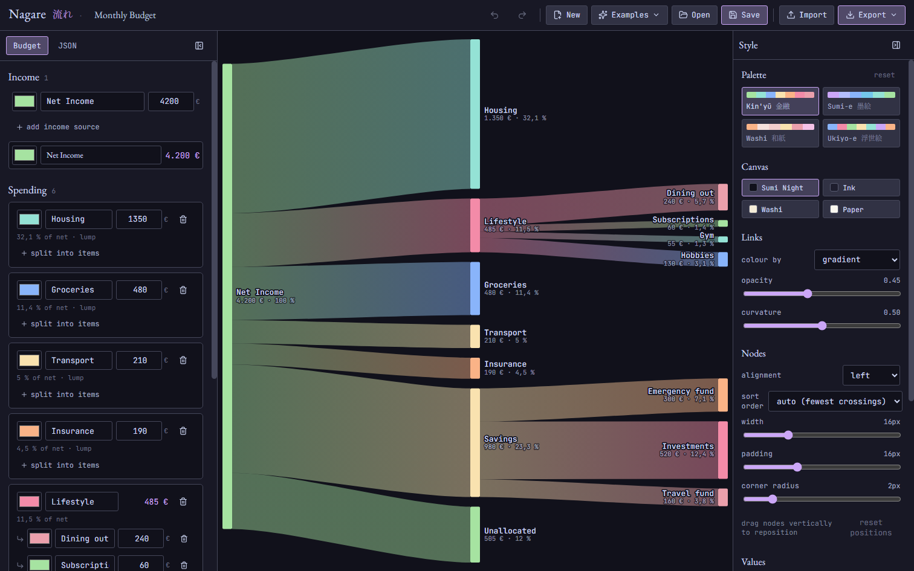

<div align="center">


# Nagare &nbsp;流れ

**_See where your money actually goes._**

[](https://react.dev)
[](https://www.typescriptlang.org)
[](https://vite.dev)
[](https://github.com/d3/d3-sankey)




</div>

## what

Nagare (流れ, "flow") draws your budget as a Sankey diagram. Type in what you
earn and what you spend it on, it works out the amounts and the percentages and
draws the thing.

I built it because every spreadsheet I made told me the numbers but never
actually showed me where the money went.

A category is either one number (rent) or a bunch of items that add up
(Leisure = dining + subscriptions). Whatever you don't assign turns into an
**Unallocated** flow so the picture always balances. Overspend and it goes red
at you.

No account, no server, nothing leaves the browser. It's all in `localStorage`.
Self-host it, it's yours.

## the bits

- fill in a budget, the diagram draws itself. no wiring nodes by hand
- hover anything to light up what it touches, click to inspect
- drag nodes up and down if the auto layout annoys you. it remembers
- four palettes (Kin'yū / Sumi-e / Washi / Ukiyo-e), light or dark paper
- percentages of income, of the parent flow, or of the column
- export PNG (@2× / @4×), SVG or JSON. import it back
- undo/redo, `Ctrl+Z` / `Ctrl+Shift+Z`
- currency + locale are yours to pick, defaults are EUR / de-DE

## how it hangs together

The budget is the only thing that's real. Everything on screen is derived from
it, re-derived on every edit:

```
Budget  --deriveModel()-->  nodes + links  --d3-sankey-->  layout  -->  svg
```

Income merges into a Net Income node, that fans out into categories, categories
with items fan out again, leftovers become Unallocated. Drag positions and
colour overrides ride along inside the budget object so they survive a save.
Old saved diagrams get migrated when they're read back.

d3-sankey does the layout maths and nothing else. The SVG is drawn by hand,
which is why hover, drag, labels and curvature behave the way I wanted instead
of the way a chart library wanted.

## running it

Yarn via [Corepack](https://github.com/nodejs/corepack), version's pinned in
`package.json`.

```bash
corepack enable
corepack yarn install
corepack yarn dev        # http://localhost:5174
```

```bash
corepack yarn build      # tsc --noEmit && vite build -> dist/
corepack yarn preview
```

## docker

nginx serving static files on :80. It does not care what's in front of it and
securing it (TLS, auth, firewall) is your problem. Traefik, NPM, Caddy, a
Cloudflare tunnel, or nothing.

```bash
docker compose up -d --build   # http://localhost
```

Publishes `80:80`, edit `docker-compose.yml` for a different host port. Or just:

```bash
docker build -t nagare .
docker run --rm -p 80:80 nagare
```

Health endpoint is `/healthz`, the container's HEALTHCHECK uses it.
